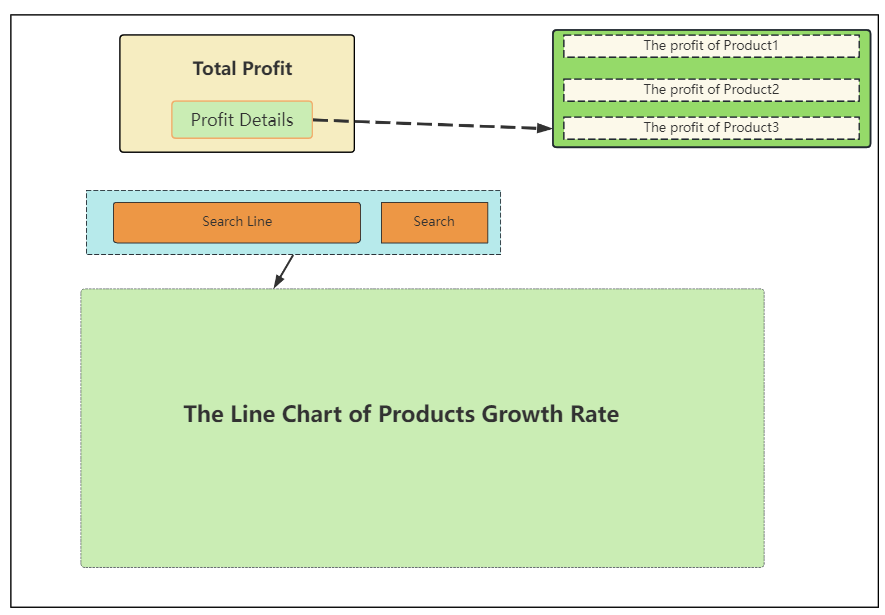
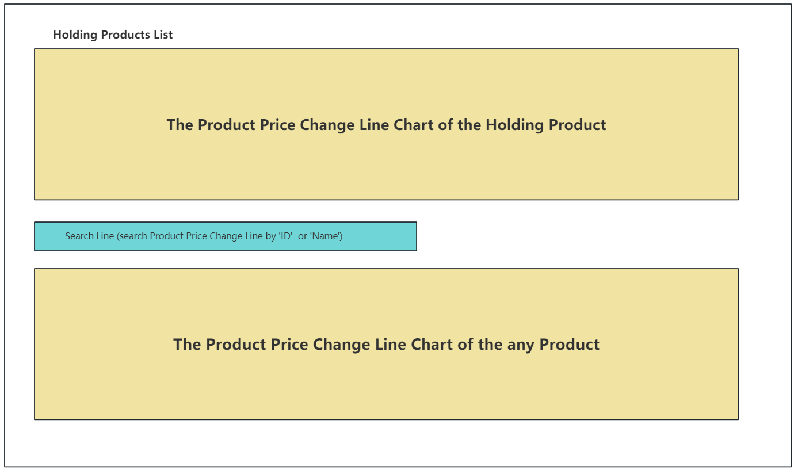
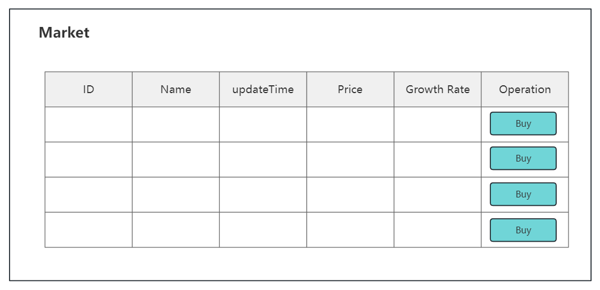

* # **FinancialPortfolio**
     # Introduction
    This project is the final project presentation of the 20th team of neuade, and the theme of the project is financial portfolio.
      
    We use Augular+SpringBoot+MySQL to manage portfolios of one or more financial products.The basic functionality the project should have.

    &nbsp;
     # Module Function
     The front-end page available for interaction. 
      
     Resful API interface available for debugging, and implement basic CRUD functions

    &nbsp;
    # Functional Modules and Diagram Design
    <!-- The information of First Page  -->
    ## 1.Front Page(Information about Assets and Assets Distribution)
     
    ## Module Details
    For this page.We need to provide some function modules about asset information and asset distribution.And make an intuitive and easy-to-understand asset holding pie chart and asset allocation chart based on the above functions.
     

    Below we will explain in detail the functions and data of each module:
    

     
     <b>1.Account information</b> : For display only.Does not contain user permission logic control.  
     <b>2.Asset Information and Asset Operation</b>: Used to  display current assets and consumption. And we will provide a button called 'Operation' to realize the function of capital injection and withdrawa. 
     <b>3.The product count of Holding</b>:A monitor used to display the number of holdings for various products. 
     <b>4.Holding product table</b>：The table used to display the information of all of  holding pruducts. In this table ,we need to provide two function buttons  <b>BUY</b> and <b>SELL</b> 
     <b>5.Pie Chart</b>: The Pie Chart is used to visualize the allocation of assets.  
     <b>6.Line Chart</b>: The Line Chart is used to visualize the holding count of the product. 
     
  
     
     <!-- The information of Secondly Page  -->
     ## 2.The Profit of Assets Page(Assets Profit Details and Growth Rate Search)
     
    ## Module Details
    We will show our asset returns on this page. And use the chart to display the change of the rate of return of the selected product in the search line.
     

    Below we will explain in detail the functions and data of each module:
    

     
     <b>1.Profit Analysis Module</b> : For this module, the content of function module need to show our total profit from various products and provide the profit details after click the button.  
     <b>2.Search Module</b>: Used to  display the trend of Products Growth Rate. In the Search Line ,we can get a Line Chart about the Growth Rate after inputting some information about the products.  
     

     <!-- The information of Thirdly Page  -->
     ## 3.Product Price Change Monitoring Module
     
    ## Module Details
    The page need to give user a Product Price Change Line Chart to show the price change trend .It should include  search function and a holding list.  
     

    Below we will explain in detail the functions and data of each module:
    

     
     <b>1.Holding Products List</b> : For the price change line chart of holding products, a holding list should be provided to the user. To facilitate users to directly see the price curve of the products they own.  
     <b>2.Search Module</b>: For the display of other polylines, a search function should be provided, using the product ID or name as the search key to monitor the user price changes of all products.  
     

     <!-- The information of Thirdly Page  -->
     ## 4.Products Market
     
    ## Module Details
    The page need to give user a Products Market.  
     

    Below we will explain in detail the functions and data of each module:
    

     
     <b>Market Module</b> : In this module . Users can scan all of the product and the information of products . For the Operation Function ,they can only buy.  
     
     
  
