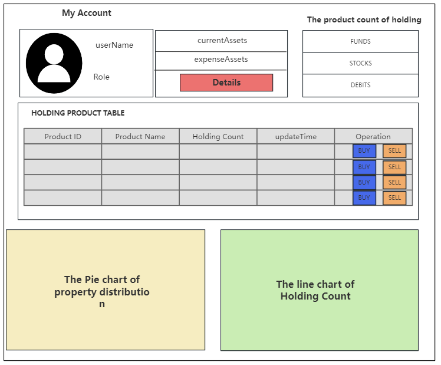

* # **FinancialPortfolio**
     # Introduction
    This project is the final project presentation of the 20th team of neuade, and the theme of the project is financial portfolio.
      
    We use Augular+SpringBoot+MySQL to manage portfolios of one or more financial products.The basic functionality the project should have.

    &nbsp;
     # Module Function
     The front-end page available for interaction. 
      
     Resful API interface available for debugging, and implement basic CRUD functions

    &nbsp;
    # Functional Modules and Diagram Design
    <!-- The information of First Page  -->
    ## Front Page(Information about Assets and Assets Distribution)
     
    ## Module Details
    For this page.We need to provide some function modules about asset information and asset distribution.And make an intuitive and easy-to-understand asset holding pie chart and asset allocation chart based on the above functions.
     

    Below we will explain in detail the functions and data of each module:
    

     
     <b>1.Account information</b> : For display only.Does not contain user permission logic control.  
     <b>2.Asset Information and Asset Operation</b>: Used to  display current assets and consumption. And we will provide a button called 'Operation' to realize the function of capital injection and withdrawa. 
     <b>3.The product count of Holding</b>:A monitor used to display the number of holdings for various products. 
     <b>4.Holding product table</b>：The table used to display the information of all of  holding pruducts. In this table ,we need to provide two function buttons  <b>BUY</b> and <b>SELL</b> 
     <b>5.Pie Chart</b>: The Pie Chart is used to visualize the allocation of assets.  
     <b>6.Line Chart</b>: The Line Chart is used to visualize the holding count of the product. 
     
  
     

     ## The Profit of Assets Page(Assets Profit Details and Growth Rate Search)
     
    >## Module Details
    >>For this page.We need to provide some function modules about asset information and asset distribution.And make an intuitive and easy-to-understand asset holding pie chart and asset allocation chart based on the above functions.
     

    >>Below we will explain in detail the functions and data of each module:
    

     >>
     >><b>1.Account information</b> : For display only.Does not contain user permission logic control.  
     >><b>2.Asset Information and Asset Operation</b>: Used to  display current assets and consumption. And we will provide a button called 'Operation' to realize the function of capital injection and withdrawa. 
     <b>3.The product count of Holding</b>:A monitor used to display the number of holdings for various products. 
     <b>4.Holding product table</b>：The table used to display the information of all of  holding pruducts. In this table ,we need to provide two function buttons  <b>BUY</b> and <b>SELL</b> 
     <b>5.Pie Chart</b>: The Pie Chart is used to visualize the allocation of assets.  
     <b>6.Line Chart</b>: The Line Chart is used to visualize the holding count of the product. 
     
  
